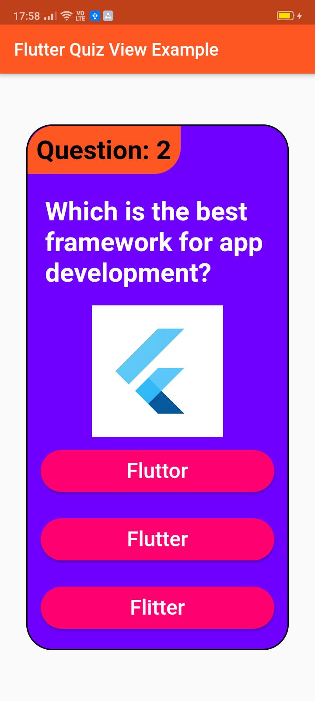
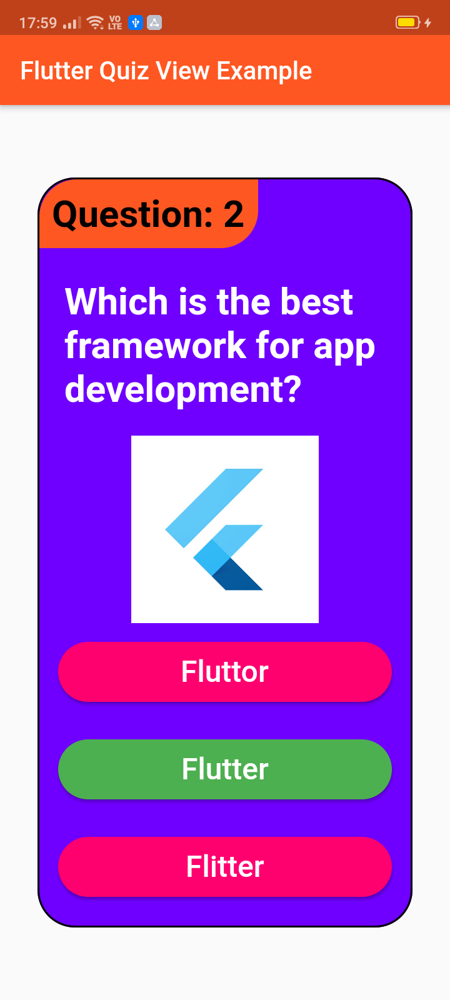

# quiz_view

A new Flutter package project that helps create quizes and surveys. It has a quiz_view customizable widget.

## Screenshots

 

## Usage

[Example](https://github.com/JayTWWM/Quiz-View-Flutter/blob/master/example/example_app.dart)

To use this package :

* add the dependency to your [pubspec.yaml] file.

```yaml
  dependencies:
    flutter:
      sdk: flutter
    quiz_view:
```

### How to use

```dart
QuizView(
  image: Container(
    width: 150,
    height: 150,
    child: Image.network(
        "https://yt3.ggpht.com/a/AATXAJyPMywRmD62sfK-1CXjwF0YkvrvnmaaHzs4uw=s900-c-k-c0xffffffff-no-rj-mo"),
  ),
  showCorrect: true,
  tagBackgroundColor: Colors.deepOrange,
  tagColor: Colors.black,
  questionTag: "Question: 2",
  answerColor: Colors.white,
  answerBackgroundColor: Color.fromARGB(255, 255, 0, 111),
  questionColor: Colors.white,
  backgroundColor: Color.fromARGB(255, 111, 0, 255),
  width: 300,
  height: 600,
  question: "Which is the best framework for app development?",
  rightAnswer: "Flutter",
  wrongAnswers: ["Fluttor", "Flitter"],
  onRightAnswer: () => print("Right"),
  onWrongAnswer: () => print("Wrong"),
)
```

# License

    Copyright 2020 Jay Mehta

    Licensed under the Apache License, Version 2.0 (the "License");
    you may not use this file except in compliance with the License.
    You may obtain a copy of the License at

        http://www.apache.org/licenses/LICENSE-2.0

    Unless required by applicable law or agreed to in writing, software
    distributed under the License is distributed on an "AS IS" BASIS,
    WITHOUT WARRANTIES OR CONDITIONS OF ANY KIND, either express or implied.
    See the License for the specific language governing permissions and
    limitations under the License.


## Getting Started

This project is a starting point for a Dart
[package](https://flutter.dev/developing-packages/),
a library module containing code that can be shared easily across
multiple Flutter or Dart projects.

For help getting started with Flutter, view our 
[online documentation](https://flutter.dev/docs), which offers tutorials, 
samples, guidance on mobile development, and a full API reference.

## Example

As time based...

``` dart
import 'package:flutter/material.dart';
import 'package:quiz_view/quiz_view.dart';

void main() {
  runApp(MyApp());
}

class MyApp extends StatelessWidget {
  @override
  Widget build(BuildContext context) {
    return MaterialApp(
      title: 'Flutter Quiz View Example',
      debugShowCheckedModeBanner: false,
      theme: ThemeData(
        primarySwatch: Colors.deepOrange,
        visualDensity: VisualDensity.adaptivePlatformDensity,
      ),
      home: MyHomePage(title: 'Flutter Quiz View Example'),
    );
  }
}

class MyHomePage extends StatefulWidget {
  MyHomePage({Key key, this.title}) : super(key: key);

  final String title;

  @override
  _MyHomePageState createState() => _MyHomePageState();
}

class _MyHomePageState extends State<MyHomePage> {
  @override
  Widget build(BuildContext context) {
    return Scaffold(
      appBar: AppBar(
        title: Text(widget.title),
      ),
      body: Center(
          child: QuizView(
        image: Container(
          width: 150,
          height: 150,
          child: Image.network(
              "https://yt3.ggpht.com/a/AATXAJyPMywRmD62sfK-1CXjwF0YkvrvnmaaHzs4uw=s900-c-k-c0xffffffff-no-rj-mo"),
        ),
        showCorrect: true,
        tagBackgroundColor: Colors.deepOrange,
        tagColor: Colors.black,
        questionTag: "Question: 2",
        answerColor: Colors.white,
        answerBackgroundColor: Color.fromARGB(255, 255, 0, 111),
        questionColor: Colors.white,
        backgroundColor: Color.fromARGB(255, 111, 0, 255),
        width: 300,
        height: 600,
        question: "Which is the best framework for app development?",
        rightAnswer: "Flutter",
        wrongAnswers: ["Fluttor", "Flitter"],
        onRightAnswer: () => print("Right"),
        onWrongAnswer: () => print("Wrong"),
      )),
    );
  }
}

```
